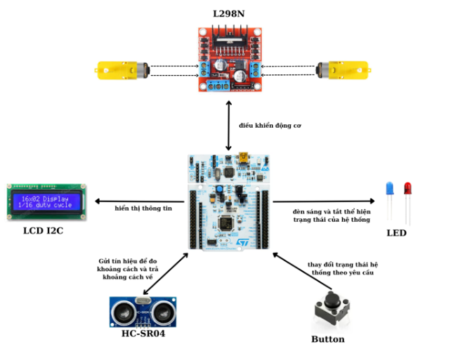
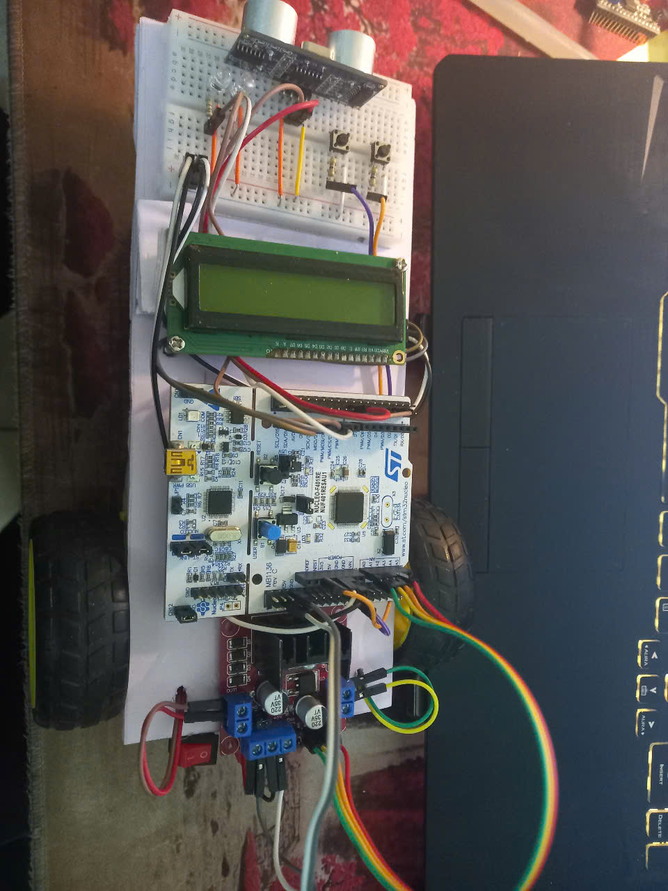
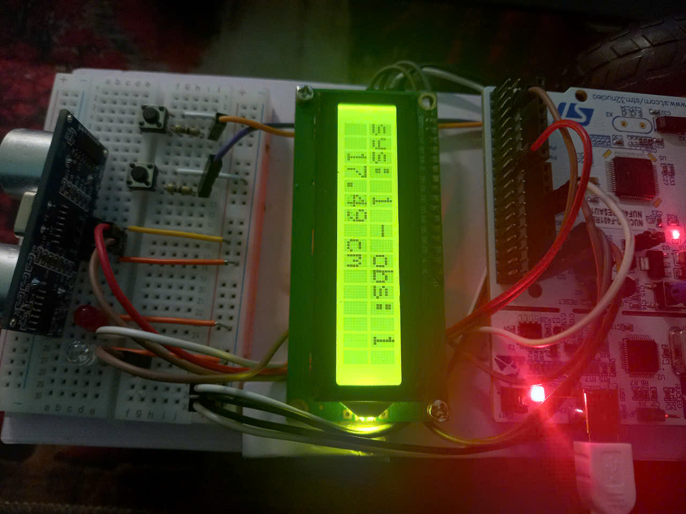

# Hệ thống đo khoảng cách và tránh vật cản sử dụng STM32 Nucleo F401RE

## Mô tả

This archive is my last semester's code file.

Hệ thống đo khoảng cách và tránh vật cản được thiết kế dựa trên STM32 Nucleo F401RE với các chức năng chính:

1. **Hiển thị thông tin trên màn hình LCD**:
   - Màn hình LCD giao tiếp qua I2C để hiển thị khoảng cách và các trạng thái.
   
2. **Đo khoảng cách và điều khiển động cơ**:
   - Sử dụng cảm biến siêu âm để đo khoảng cách.
   - Điều khiển động cơ DC thông qua timer.
   - Kiểm tra khoảng cách bằng giao tiếp UART trên Putty trước khi hiển thị trên LCD.

3. **Chức năng của Button**:
   - Button được sử dụng để thực hiện các chức năng qua ngắt ngoài.

4. **Chức năng của LED**:
   - Sử dụng `getTick()` để tránh hệ thống bị treo (blocking).
5. **Điều khiển động cơ**
   - Sử dụng driver L298N để điều khiển 2 động cơ, sử dụng PWM cấp xung cho 2 chân ENA, ENB, nếu muốn, chỉ cần cấp cung cho IN1 và IN3.
---

## Đầu vào

- **Cảm biến**: Hệ thống sử dụng cảm biến siêu âm, hồng ngoại hoặc radar để phát hiện và đo khoảng cách đến vật cản.
- **Button**:
  - **SW1**: Chuyển đổi giữa trạng thái hoạt động và trạng thái dừng. Khi hệ thống dừng, nhấn SW1 để kích hoạt và ngược lại. Khi hoạt động, hệ thống giám sát khoảng cách và hiển thị trên LCD.
  - **SW2**: Reset hệ thống về trạng thái ban đầu.

---

## Đầu ra

- **LED**:
  - **LED xanh**: Nhấp nháy với tần số 1Hz khi hệ thống hoạt động, tắt khi hệ thống dừng.
  - **LED đỏ**: Nhấp nháy với tần số từ 2Hz đến 10Hz khi phát hiện vật cản. Tần số nhấp nháy tỷ lệ nghịch với khoảng cách đến vật cản. Tắt khi không có vật cản.

- **Màn hình LCD**:
  - Hiển thị trạng thái hệ thống:
    - `0`: Bình thường.
    - `1`: Hoạt động.
  - Hiển thị trạng thái vật cản:
    - `0`: Không có vật cản.
    - `1`: Có vật cản.
  - Hiển thị khoảng cách đến vật cản.

---

## Sơ đồ hệ thống

## Sơ đồ nối các chân

---

## Kết quả

