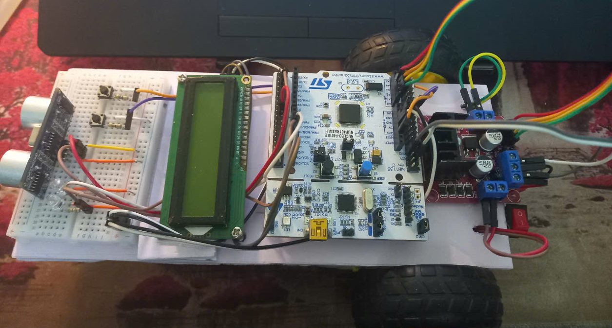

# Hệ thống đo khoảng cách và tránh vật cản sử dụng STM32 Nucleo F401RE

## Mô tả

This archive is my last semester's code file.

Hệ thống đo khoảng cách và tránh vật cản được thiết kế dựa trên STM32 Nucleo F401RE với các chức năng chính:

1. **Hiển thị thông tin trên màn hình LCD**:
   - Màn hình LCD giao tiếp qua I2C để hiển thị khoảng cách và các trạng thái.
   
2. **Đo khoảng cách và điều khiển động cơ**:
   - Sử dụng cảm biến siêu âm để đo khoảng cách.
   - Điều khiển động cơ DC thông qua timer.
   - Kiểm tra khoảng cách bằng giao tiếp UART trên Putty trước khi hiển thị trên LCD.

3. **Chức năng của Button**:
   - Button được sử dụng để thực hiện các chức năng qua ngắt ngoài.

4. **Chức năng của LED**:
   - Sử dụng `getTick()` để tránh hệ thống bị treo (blocking).
5. **Điều khiển động cơ**
   - Sử dụng driver L298N để điều khiển 2 động cơ, sử dụng PWM cấp xung cho 2 chân ENA, ENB, nếu muốn, chỉ cần cấp cung cho IN1 và IN3.
---


## Sơ đồ hệ thống

<p align="center">  
    
</p> 

## Sơ đồ nối các chân

**Cảm biến**
- TRIG      PA9
- ECHO      PA10

**Các LED**
- LED_Green PA6
- LED_RED   PA7

**BUTTON**
- PC13  

**Driver L298N**
- IN1_PIN PA0  
- IN2_PIN PA1  
- ENA     PA5
- IN3_PIN PA4  
- IN4_PIN PB0  
- ENB     PB7

```c
#define SLAVE_ADDRESS_LCD 0x27
```

---

## Kết quả
<p align="center">  
    
</p> 

<p align="center">  
    
</p>
